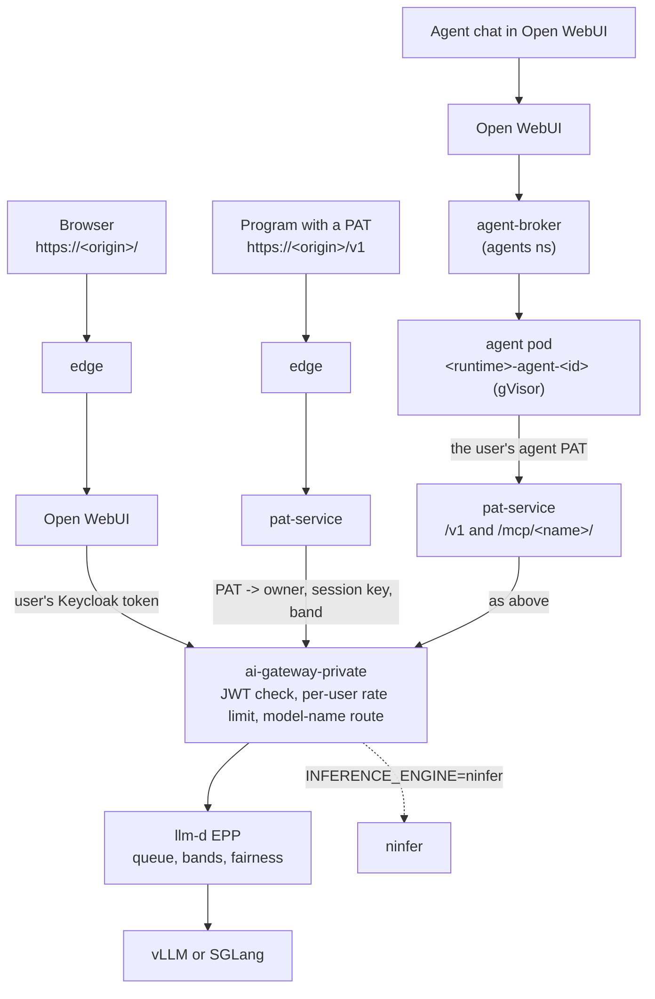

# System overview

[Русский](overview.ru.md) | [Handbook index](README.md)

What the stack is made of, which namespace holds what, and the three ways a
request reaches the model. Every other page in this handbook zooms into one
box of the diagrams below.

**Contents**

- [One sentence](#one-sentence)
- [Components](#components)
- [Namespaces](#namespaces)
- [Three request paths](#three-request-paths)
- [Identity through the request](#identity-through-the-request)
- [Who owns what in the repository](#who-owns-what-in-the-repository)
- [Where it lives](#where-it-lives)
- [Related](#related)

## One sentence

A Kubernetes stack that puts one identity boundary (Keycloak) in front of a
local LLM: people chat in Open WebUI, programs call an OpenAI-compatible
`/v1` with personal access tokens (PATs), per-user agents run in sandboxed
pods, and everything is queued fairly by llm-d EPP in front of one GPU
engine, traced in Langfuse and measured in Prometheus/Grafana.

## Components

| Component | Role | Handbook page |
| --- | --- | --- |
| Envoy Gateway `edge` | the only public listener; splits one origin by path | this page |
| Keycloak (realm `ai-stack`) | sign-in, roles `ai-user` / `ai-admin` | [Open WebUI](openwebui.md), [PAT service](pat-service.md) |
| Open WebUI | browser chat, model picker, MCP tools per chat | [Open WebUI](openwebui.md) |
| pat-service | PAT dashboard `/platform`, `/v1` proxy, MCP proxy `/mcp/<name>/`, session key and priority label | [PAT service](pat-service.md) |
| Envoy AI Gateway (`ai-gateway-private`) | cluster-internal OpenAI routing by model name, per-user rate limit, GenAI tracing | [Inference](inference/README.md) |
| llm-d EPP | queue, priority bands, per-user fairness, endpoint scoring | [Queues and fair share](inference/queues-and-fair-share.md) |
| vLLM / SGLang / ninfer | the model engine; exactly one owns the GPU | [Engines](engines/README.md) |
| bge-m3 embeddings | `/v1/embeddings`, CPU or GPU-loan mode | [Engines](engines/README.md) |
| agent-broker + agent pods | per-user Hermes, pi and opencode agents under gVisor | [Agents](agents/README.md) |
| web-search, repowise | MCP servers behind pat-service | [MCP](mcp/README.md) |
| OTEL Collector, Langfuse | traces with prompts, answers, user and session | [Langfuse](observability/langfuse.md) |
| Prometheus, Grafana | metrics and dashboards | [Observability](observability/README.md) |
| CloudNativePG, ClickHouse, Valkey, MinIO | state, each run by its operator | [Data and retention](observability/data-and-retention.md) |

## Namespaces

| Namespace | Holds |
| --- | --- |
| `airgap-ai-stack` | all application workloads: gateway routes, Keycloak, Open WebUI, pat-service, EPP, engines, embeddings, Langfuse, Prometheus, MCP servers |
| `agents` | `agent-broker` and the per-user agent pods, PVCs and Secrets |
| `envoy-gateway-system`, `envoy-ai-gateway-system` | the two gateway controllers and the Envoy proxies |
| `monitoring` | the operator Grafana (`eg-addons` release) with Loki, Tempo and its own Prometheus |
| `cnpg-system`, `clickhouse-operator`, `redis-operator`, `minio-operator` | the operators; their custom resources live in `airgap-ai-stack` |

## Three request paths

- **Browser.** Open WebUI calls the private AI Gateway directly with the
  signed-in user's Keycloak token. It never passes through pat-service, so
  its requests carry no priority band and land in EPP's lowest band `0`
  (see [queues](inference/queues-and-fair-share.md)).
- **API.** `/v1` accepts only `sk-...` PATs. pat-service resolves the owner,
  derives a session key and a band, and calls the gateway with its own
  service-account JWT plus the identity headers.
- **Agents.** Open WebUI lists `hermes-agent`, `pi-agent` and
  `opencode-agent` from a third connection to `agent-broker`. The broker
  starts the user's agent pod on demand; the agent calls the model and the
  MCP servers through pat-service with the user's own agent PAT.

Grafana and Langfuse have no public route: operators reach them through
NodePorts on the host network ([observability](observability/README.md)).
`/sso/admin` and `/sso/realms/master` are refused at the edge with 404;
Keycloak administration goes through `kubectl port-forward svc/keycloak`.

## Identity through the request

Every path ends with the same trusted headers on the request to the model:

| Header | Set by | Used for |
| --- | --- | --- |
| `X-User-Id` | Open WebUI (from the JWT) or pat-service (PAT owner) | per-user rate limit, Langfuse `user_subject` |
| `X-User-Name` | same | Langfuse user |
| `X-Pat-Token-Id` | pat-service | Langfuse metadata: which PAT |
| `X-Session-Key` | pat-service | Langfuse session, EPP warmth ([PAT service](pat-service.md#session-stitching)) |
| `X-Llm-D-Inference-Objective` | pat-service | EPP priority band |
| `X-Llm-D-Inference-Fairness-Id` | pat-service | EPP per-user fairness |

Client-supplied copies are stripped at the edge and again in pat-service.
A header on its own asserts nothing: the gateway validates the JWT that
comes with it. Details and the security reasoning are in
[docs/security](../security/README.md).

## Who owns what in the repository

Every Kubernetes object has exactly one owner
([ADR 0002](../adr/0002-one-owner-per-object.md)):

| Path | Owns | Applied by |
| --- | --- | --- |
| `k8s/base` | profile-neutral workloads | rendered into `helm/airgap-stack` by `scripts/helm-render` |
| `k8s/overlays/remote-wsl-vllm-nvfp4` | GPU prerequisites and site patches of the remote profile | same render; GPU objects by `make gpu-objects-up` |
| `helm/airgap-stack` | routing, AI Gateway routes, rate limits, rendered workloads | `make helm-up` |
| `helm/vllm-inference`, `helm/sglang-inference`, `helm/ninfer-inference`, `helm/embeddings-inference` | one engine each | `make engine-up`, `make embeddings-up` |
| `config/llmd/router-nvfp4-values.yaml` | the llm-d EPP release | `make llmd-up` |
| `k8s/agents`, `config/agents` | agent-broker and the agent catalog | `make agents-up`, `make agent-catalog` |
| `helm/web-search`, `helm/repowise` | the MCP servers | `make websearch-up`, `make repowise-up` |
| `versions.lock.env` | every pinned image and chart version | read by the Makefile |
| `.env` (not committed) | secrets and site values | `make helm-up` and friends |

`make verify` renders and validates all of it without a cluster and fails
if the committed chart drifted from its sources. Run it before every commit
that touches manifests. `make stack-up` is the one full deploy path of the
remote profile; the step-by-step install is [docs/install](../install/README.md).

## Where it lives

- Architecture reference: [docs/architecture](../architecture/README.md)
- Security boundaries: [docs/security](../security/README.md)
- Repository rules for humans and agents: [AGENTS.md](../../AGENTS.md)
- Decisions: [docs/adr](../adr/README.md)

## Related

- Next: [Open WebUI](openwebui.md)
- [Handbook index](README.md)
